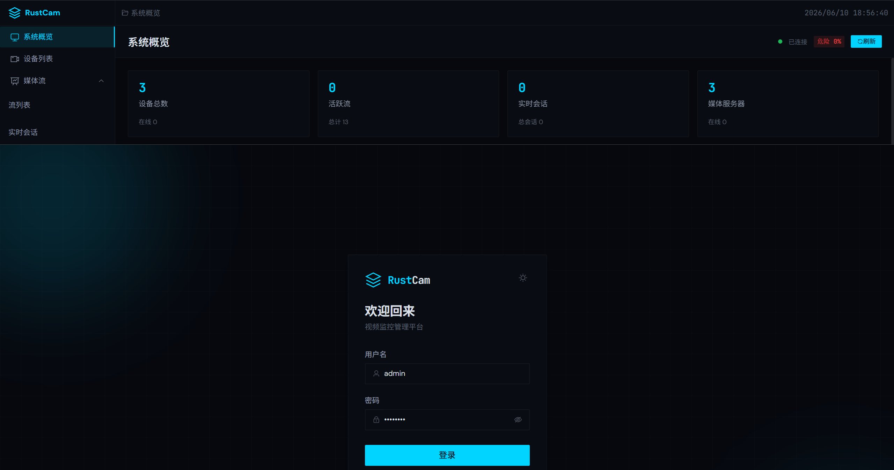
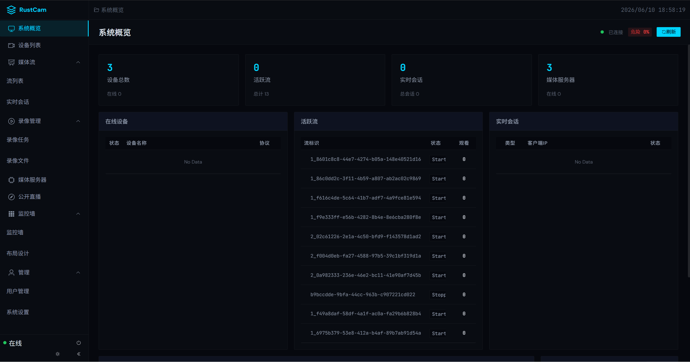
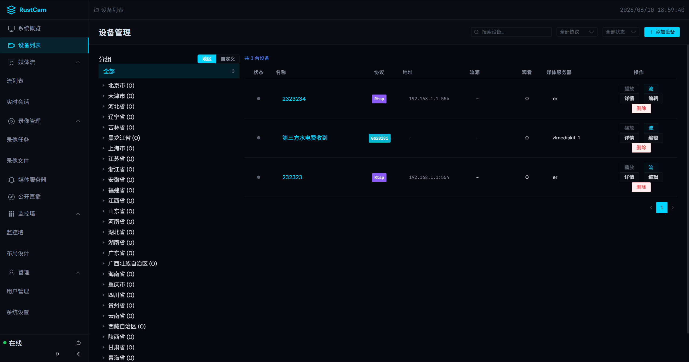
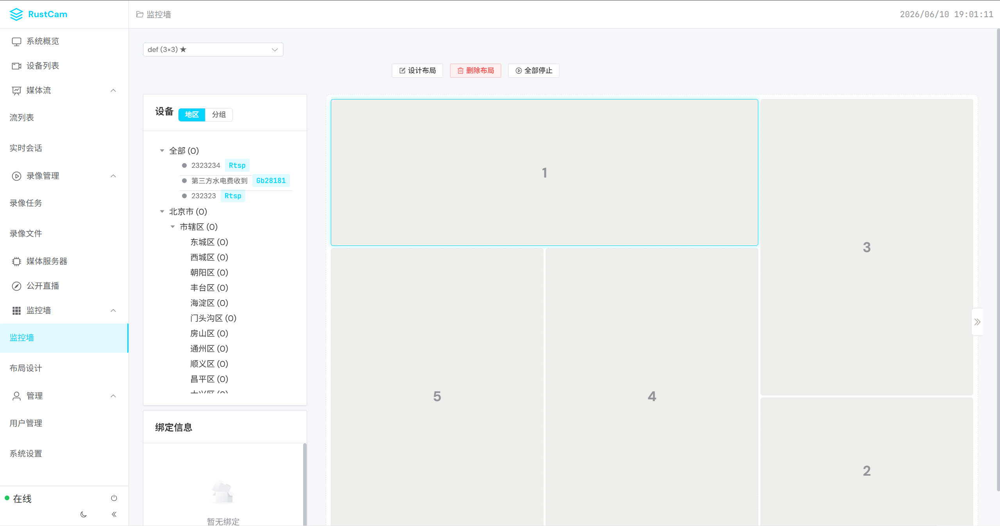

# RUSTCAM

现代化视频监控网关与信令控制平台，基于 Rust 后端 + Vue 前端构建，支持多协议设备接入、实时视频播放、录像回放、云台控制等功能。

## 功能特性

| 类别 | 功能 |
|------|------|
| 视频服务 | 实时播放、多画面布局、录像回放 |
| 设备管理 | 设备发现、注册、状态监控、分组管理 |
| 云台控制 | PTZ 协议支持、预置位管理 |
| 流媒体 | 集群部署、多服务器适配 (ZLMediKit/SRS/Xiu) |
| 用户权限 | JWT 认证、RBAC 权限控制 |

## 技术栈

### 后端 (Rust)

| 层级 | 技术 |
|------|------|
| 协议 | RTSP、GB28181、ONVIF、WebSocket |
| 认证 | JWT + Casbin |
| 存储 | Redis (缓存) + PostgreSQL (持久化) |

### 前端 (Vue)

| 类别 | 技术 |
|------|------|
| 框架 | Vue 3 + Element Plus |
| 状态 | Pinia |
| 图表 | ECharts + Vue-ECharts |
| 视频 | flv.js、hls.js、video.js |
| 构建 | Vite |

## 项目结构

```
RUSTCAM/
├── src/                    # Rust 后端
│   ├── api/               # HTTP API
│   ├── application/       # 应用服务
│   ├── auth/              # 认证授权
│   ├── domain/            # 数据模型
│   ├── infrastructure/    # 基础设施
│   ├── protocol/          # 协议实现
│   └── transport/         # 网络传输
├── frontend/              # Vue 前端
│   └── src/
├── sql/                   # 数据库脚本
└── tests/                 # 测试用例
```

## 截图预览

| 登录 | 仪表盘 | 设备分组 | 摄像头墙 |
|:----:|:------:|:--------:|:--------:|
|  |  |  |  |

## License

MIT License - 详见 [LICENSE](./LICENSE)
